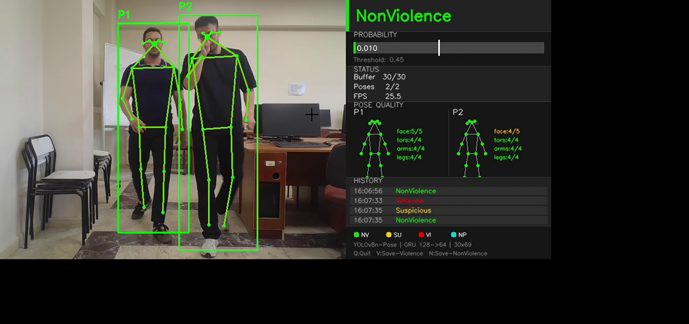
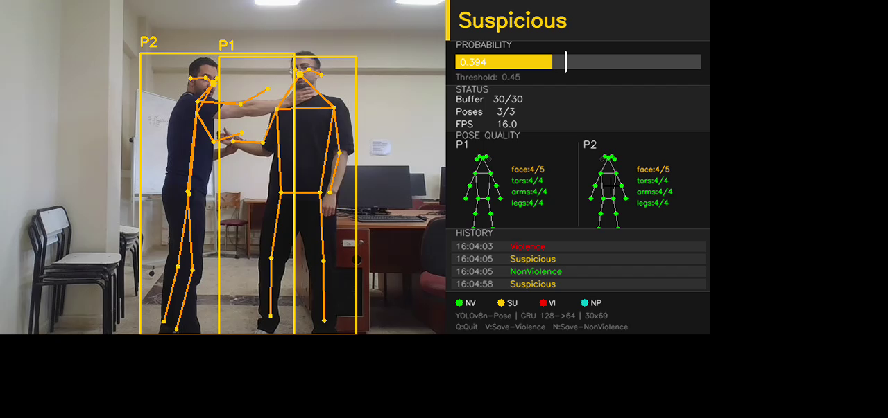
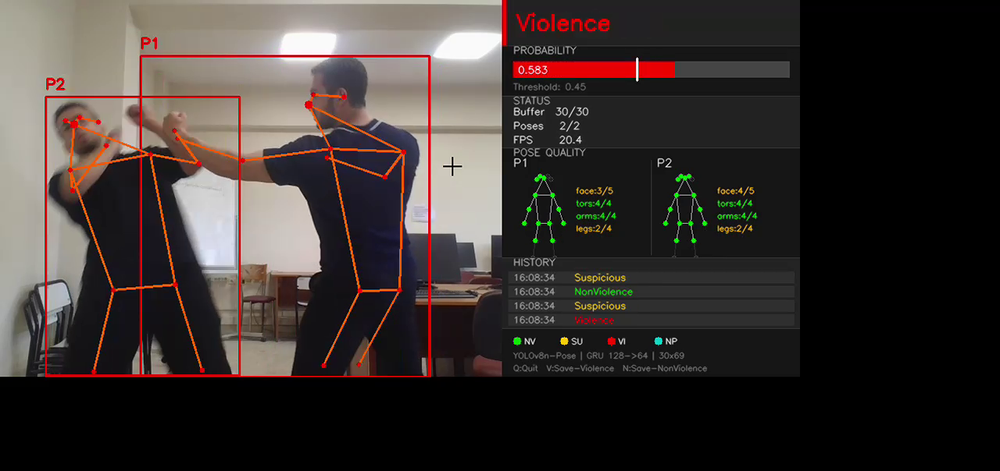

### 📌 Gerçek Zamanlı İskelet Tabanlı Şiddet Tespiti


Bu proje, canlı kamera veya video akışından insan iskeletlerini çıkararak **Violence / NonViolence** sınıflandırması yapan hafif ve gerçek zamanlı bir görüntü işleme sistemidir.

## 📌 Proje Hakkında

Bu çalışma, Pamukkale Üniversitesi Bilgisayar Mühendisliği 3. sınıf Görüntü İşleme dersi kapsamında geliştirilmiştir. Amaç, klasik piksel tabanlı video sınıflandırma yaklaşımlarına alternatif olarak, insan pozlarını temsil eden iskelet verileri üzerinden şiddet davranışını tespit eden uçtan uca bir sistem kurmaktır.

Proje; görüntü iyileştirme, gürültü azaltma, renk uzayı dönüşümü, nesne/poz çıkarımı ve zaman serisi sınıflandırması gibi görüntü işleme ve makine öğrenmesi konularını birlikte kullanır. Her kare önce CLAHE, Gaussian blur, resize ve BGR→RGB dönüşümünden geçirilir; ardından YOLOv8n-Pose ile 17 COCO keypoint çıkarılır.

Ham piksel yerine iskelet kullanmanın iki önemli avantajı vardır. Birincisi, model kişinin yüzünü veya kıyafetini değil, hareket geometrisini görür; bu da gizlilik açısından daha güvenli bir yaklaşımdır. İkincisi, ışık değişimi, arka plan karmaşıklığı ve renk farklılıkları modele daha az yansır.

Sistem gerçek zamanlı çalışacak şekilde tasarlanmıştır. Eğitim tarafında ağır video işleme adımları Kaggle GPU üzerinde offline yapılır; canlı kullanımda ise sadece anlık karelerden iskelet çıkarılıp 30 frame’lik FIFO buffer üzerinden GRU modeliyle karar üretilir.

## 🔧 Sistem Mimarisi

```text
[Raw Video]
    │
    ▼  Offline Preprocessing (Kaggle GPU)
    ├─ 10 FPS sampling
    ├─ Conditional CLAHE → Gaussian 3×3 → Resize 640×640 → BGR→RGB
    ├─ YOLOv8n-Pose → 17 COCO keypoints per person
    ├─ Top-2 person selection (by bbox area, X-sorted)
    ├─ Hip centering + shoulder–hip scaling
    ├─ 69-dim feature vector / frame
    ├─ 30-frame sliding windows (stride=15)
    └─ Motion filter θ=0.05 on Violence windows only
           │
           ▼  (N, 30, 69) .npy sequences
    ┌──────────────────────────────┐
    │  GRU Classifier (Training)   │
    │  2-layer GRU 128→64          │
    │  BCELoss + Adam, max 100 ep  │
    │  Early stopping on val_loss  │
    └──────────────────────────────┘
           │
           ▼  models/best_model.pt
[Live Camera / Video]
    │
    ▼  Online Inference (real-time)
    ├─ Same frame preprocessing
    ├─ FIFO buffer (30 frames)
    ├─ Pose quality gate (partial head/invalid torso → No Valid Pose)
    ├─ GRU → sigmoid score
    ├─ Triple-zone decision (t=0.45):
    │    score < 0.35  →  NonViolence
    │    0.35–0.45     →  Suspicious
    │    score ≥ 0.45  →  Violence
    ├─ Temporal smoothing (3-window majority)
    ├─ Entry suppression (30f on new person)
    └─ OpenCV display + pose skeleton overlay
```

Offline preprocessing ile online inference bilinçli olarak ayrılmıştır. YOLO ile tüm veri setini işlemek zaman aldığı için eğitim verisi bir kez `.npy` olarak üretilir. Canlı kullanımda ise aynı kare ön işleme ve feature builder mantığı korunarak train/serve farkı oluşması engellenir.

### 🖼️ OpenCV Arayüzü — Sistem Çıktıları

**🟢 NonViolence** — `p = 0.010` — İki kişi normal yürüyüş, iskelet yeşil



---

**🟡 Suspicious** — `p = 0.394` — Bir kişi diğerinin boğazını tutuyor, iskelet sarı (0.35–0.45 arası)



---

**🔴 Violence** — `p = 0.583` — Aktif kavga, iskelet kırmızı, eşik aşıldı



## 🔬 Görüntü İşleme Pipeline'ı

Pipeline dört temel kare ön işleme adımıyla başlar:

| Adım | İşlem             | Gerekçe                                                                     |
| ---- | ----------------- | --------------------------------------------------------------------------- |
| 1    | Conditional CLAHE | Karanlık/düşük kontrastlı karelerde yerel kontrastı artırır.                |
| 2    | GaussianBlur 3×3  | Sensör gürültüsünü azaltır; keypoint kenarlarını aşırı bozmaz.              |
| 3    | Resize 640×640    | YOLOv8n-Pose giriş boyutuyla uyumlu standart çözünürlük sağlar.             |
| 4    | BGR→RGB           | OpenCV BGR, Ultralytics/PyTorch RGB beklediği için kanal sırasını düzeltir. |

Bu sıra önemlidir: önce kontrast iyileştirilir, ardından gürültü azaltılır, sonra modelin beklediği boyuta ve renk düzenine geçilir. Böylece YOLOv8n-Pose daha kararlı keypoint çıkarır.

YOLOv8n-Pose her kişi için 17 COCO keypoint üretir. Sahnede birden fazla kişi varsa bounding box alanına göre en büyük iki kişi seçilir ve X eksenine göre sıralanır. Keypoint confidence değeri `0.5` altında kalan noktalar güvenilmez kabul edilir.

İskeletler **hip centering** ve **shoulder-hip scaling** ile normalize edilir. Hip centering, kişinin görüntüde nerede durduğundan bağımsız bir temsil sağlar; shoulder-hip scaling ise kameraya yakınlık/uzaklık etkisini azaltır.

Her kare için feature vector şu şekilde oluşturulur:

```python
person_1 = 17 keypoints × 2 coordinates = 34
person_2 = 17 keypoints × 2 coordinates = 34
interaction_distance = 1
total = 69 dimensions
```

## 🧠 Model

Model, `(30, 69)` boyutlu sequence window girdisini alan GRU tabanlı ikili sınıflandırıcıdır. Çıkışta sigmoid aktivasyonu ile `P(Violence)` olasılığı üretilir.

| Model       | Avantaj                                      | Bu proje için değerlendirme                                     |
| ----------- | -------------------------------------------- | --------------------------------------------------------------- |
| LSTM        | Uzun bağımlılıkları iyi taşır                | GRU’ya göre daha fazla parametre ve hesaplama maliyeti getirir. |
| Transformer | Büyük veri ve uzun sekanslarda güçlüdür      | Bu ölçekte veri ve 30 frame pencere için gereğinden ağırdır.    |
| **GRU**     | Hafif, hızlı, kısa zaman serilerinde yeterli | **Seçilen modeldir; gerçek zamanlı kullanım için uygundur.**    |

Mimari:

- **Girdi:** `(batch, 30, 69)`
- **GRU 1:** 128 hidden unit
- **Dropout:** 0.3
- **GRU 2:** 64 hidden unit
- **Dense:** 64→32 + ReLU
- **Çıkış:** 32→1 + Sigmoid
- **Parametre sayısı:** 115,777

Bu düşük parametre sayısı sayesinde modelin sınıflandırma kısmı CPU’da çalışabilecek kadar hafiftir. Gerçek zamanlı maliyetin büyük bölümü YOLOv8n-Pose keypoint çıkarımından gelir.

## 📁 Dataset ve Eğitim

Veri seti RLVS ve RWF-2000 kaynaklarının birleşiminden oluşur. RLVS için 70/15/15 stratified split uygulanmış, RWF-2000 ise kendi train/val bölünmesiyle train ve val tarafına eklenmiştir. Test split RLVS-only bırakılarak karşılaştırılabilirlik korunmuştur.

| Split | Sequences | Violence | NonViolence | Source          |
| ----- | --------: | -------: | ----------: | --------------- |
| Train |     6,423 |    3,227 |       3,196 | RLVS + RWF-2000 |
| Val   |     1,435 |      683 |         752 | RLVS + RWF-2000 |
| Test  |       740 |      277 |         463 | RLVS only       |

Eğitimde `BCELoss`, `Adam`, batch size `32`, maksimum `100` epoch ve `val_loss` tabanlı early stopping kullanılmıştır. En iyi model `models/best_model.pt` olarak, en düşük validation loss değerine göre kaydedilmiştir.

Video-level etiketler pencere seviyesinde gürültü oluşturabildiği için sadece Violence pencerelerine **motion filter θ=0.05** uygulanmıştır. Böylece şiddet etiketi taşıdığı hâlde düşük hareket içeren sakin bölümlerin eğitime etkisi azaltılmıştır.

## 📊 Sonuçlar

### Final Model — RLVS + RWF-2000, threshold = 0.45

| Metric      |      Value |
| ----------- | ---------: |
| Precision   |     0.7749 |
| Recall      |     0.8700 |
| **F1**      | **0.8197** |
| **AUC-ROC** | **0.9272** |
| Accuracy    |      85.7% |

Test seti 740 sequence içerir: `TP=241`, `FP=70`, `FN=36`, `TN=393`.

### Ablation Özeti

| Experiment                                |        F1 |   AUC-ROC |      ΔF1 |
| ----------------------------------------- | --------: | --------: | -------: |
| Baseline (RLVS-only, t=0.70)              |     0.667 |     0.921 |        — |
| Threshold sweep → t=0.40                  |     0.827 |     0.921 |   +0.160 |
| **Blended model (RLVS+RWF-2000, t=0.45)** | **0.820** | **0.927** | deployed |
| P7.2 No interaction feature (68-dim)      |     0.825 |     0.931 |   +0.005 |
| P7.3 No normalization                     |     0.827 |     0.938 |   +0.007 |
| P7.3 Hip centering only                   |     0.823 |     0.937 |   +0.003 |
| P7.3 Scale only (no centering)            |     0.819 |     0.925 |   -0.001 |
| P7.4 Motion-filter θ=0.00                 |     0.831 |     0.923 |   +0.011 |
| P7.4 Motion-filter θ=0.025                |     0.819 |     0.919 |   -0.000 |
| P7.4 Motion-filter θ=0.075                |     0.798 |     0.923 |   -0.022 |
| P7.4 Motion-filter θ=0.10                 |     0.830 |     0.931 |   +0.010 |

Sonuçlar, iskelet tabanlı hafif bir modelle yüksek AUC-ROC elde edilebildiğini gösterir. En zayıf taraf, bazı NonViolence hareketlerinin iskelet geometrisi açısından Violence davranışına benzemesi nedeniyle false positive üretilebilmesidir.

## 🚀 Kurulum ve Çalıştırma

### Gereksinimler

- Python 3.13
- PyTorch
- OpenCV
- Ultralytics YOLOv8
- CUDA opsiyonel; GPU eğitim ve YOLO inference için önerilir

```bash
python -m venv .venv
.\.venv\Scripts\activate
pip install torch torchvision --index-url https://download.pytorch.org/whl/cu126
pip install -r requirements.txt
```

### Temel Komutlar

```bash
python -m src.inference
python -m src.evaluate
python -m src.train
```

<details>
<summary>CLI seçenekleri</summary>

| Option         | Type      | Default | Açıklama                                                    |
| -------------- | --------- | ------- | ----------------------------------------------------------- |
| `--source`     | `str/int` | `0`     | Kamera index'i veya video dosyası yolu.                     |
| `--threshold`  | `float`   | `0.45`  | Violence kararı için sigmoid threshold.                     |
| `--collect`    | `str`     | `None`  | Fine-tuning için 30-frame `.npy` sequence kaydetme klasörü. |
| `--no-display` | `flag`    | `False` | OpenCV penceresi olmadan terminal çıktısı üretir.           |

</details>

## 📁 Proje Klasör Yapısı

```text
configs/
  config.py                  # Sabitler, eşikler, model ve eğitim hiperparametreleri
data/
  sequences/                 # Eğitim/val/test .npy sequence dosyaları
docs/
  architecture.md            # Sistem mimarisi ve akış diyagramları
  data_pipeline.md           # Offline preprocessing ve veri yaşam döngüsü
  evaluation.md              # Metrikler, threshold ve ablation sonuçları
  limitations.md             # Bilinen kısıtlamalar
  decision_log.md            # Kilit tasarım kararları
models/
  best_model.pt              # En iyi GRU checkpoint'i
  training_log.csv           # Eğitim logları
notebooks/
  kaggle_preprocessing.ipynb # Kaggle üzerinde offline preprocessing
scripts/
  run_ablation_eval.py       # Ablation eğitim/değerlendirme aracı
src/
  preprocessing.py           # Kare ön işleme, pose ve feature vector üretimi
  model.py                   # ViolenceGRU modeli
  dataset.py                 # .npy sequence loader
  train.py                   # Eğitim döngüsü
  evaluate.py                # Test değerlendirmesi
  inference.py               # Canlı OpenCV inference
  overlay_panel.py           # OpenCV bilgi paneli çizimi
```

## ⚠️ Bilinen Kısıtlamalar

- **İki kişi sınırı:** Feature vector sabit kalsın diye sadece en büyük iki kişi işlenir; kalabalık sahnelerde bilgi kaybı olabilir.
- **Pose-only temsil:** Model silah, kan, nesne veya sahne bağlamını görmez; sadece iskelet geometrisini değerlendirir.
- **X-axis sorting kararsızlığı:** İki kişi üst üste geldiğinde kişi sırası kısa süreli yer değiştirebilir.
- **Video-level label noise:** Etiketler pencere seviyesinde değil video seviyesindedir; motion filter bu etkiyi azaltır ama tamamen yok etmez.
- **Domain shift:** YouTube/kamera kaynaklı eğitim verisi ile gerçek güvenlik kamerası görüntüleri arasında açı, ışık ve çözünürlük farkı olabilir.

## 🎓 Öğrenilen Görüntü İşleme Konuları

Bu proje, derste öğrenilen birçok temel konunun gerçek bir problem üzerinde birlikte kullanılmasını sağlar:

- **Histogram equalization / CLAHE:** Karanlık karelerde yerel kontrast artırımı.
- **Noise filtering:** Gaussian blur ile sensör gürültüsünü azaltma.
- **Color spaces:** OpenCV BGR formatından RGB formatına dönüşüm.
- **Resize ve koordinat sistemi:** YOLO giriş boyutuna uygun 640×640 standardizasyon.
- **Feature extraction:** YOLOv8n-Pose ile 17 keypoint çıkarımı.
- **Keypoint confidence:** Güvenilir/güvenilmez nokta ayrımı.
- **Normalization:** Hip centering ve shoulder-hip scaling ile konum/ölçek bağımsız temsil.
- **Temporal windowing:** 30 frame sequence window ile hareketin zamansal bağlamını modelleme.
- **Evaluation metrics:** Accuracy yerine Precision, Recall, F1 ve AUC-ROC ile daha dengeli değerlendirme.
