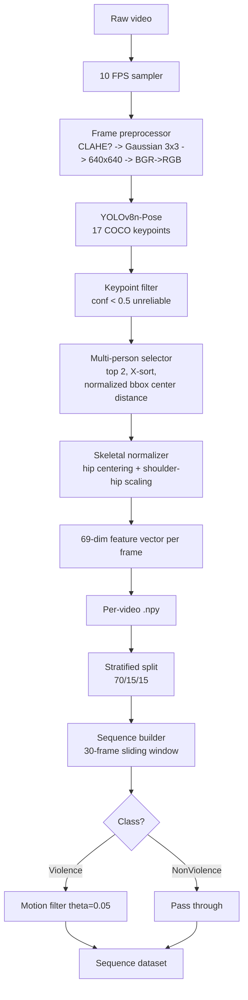

# architecture.md

End-to-end architecture for the skeletal-pose-based violence detection system. The architecture is intentionally split into two phases that share the same per-frame feature builder.

## 1. Component Boundaries

| Component             | Phase             | Responsibility                                                                                  |
| --------------------- | ----------------- | ----------------------------------------------------------------------------------------------- |
| Video reader          | offline + online  | Decodes frames from file or live source                                                         |
| FPS sampler           | offline           | Resamples to **10 FPS** target                                                                  |
| Frame preprocessor    | offline + online  | Conditional CLAHE → Gaussian 3×3 → 640×640 → BGR→RGB                                            |
| Pose extractor        | offline + online  | YOLOv8n-Pose, 17 COCO keypoints                                                                 |
| Keypoint filter       | offline + online  | Drops keypoints with confidence `< 0.5`                                                         |
| Multi-person selector | offline + online  | Top 2 persons, X-axis sort, normalized bbox center distance                                     |
| Feature builder       | offline + online  | Emits **69-dim** feature vector per frame                                                       |
| Skeletal normalizer   | offline + online  | Hip centering + shoulder–hip scaling                                                            |
| `.npy` writer         | offline           | Persists per-video feature arrays                                                               |
| Sequence builder      | offline           | 30-frame sliding windows                                                                        |
| Motion filter         | offline           | Drops Violence windows with motion `< θ = 0.05`                                                 |
| Split manager         | offline           | Stratified 70 / 15 / 15 train/val/test                                                          |
| GRU classifier        | training + online | Sigmoid probability of Violence                                                                 |
| Trainer               | training          | BCELoss + Adam, max 100 epochs, batch 32, early stopping on val_loss                            |
| Evaluator             | evaluation        | Confusion matrix, precision, recall, F1, AUC-ROC                                                |
| FIFO buffer           | online            | 30-frame ring of feature vectors                                                                |
| Decision module       | online            | **Triple-zone** threshold on sigmoid: p<0.35 NonViolence, 0.35≤0.45 Suspicious, p≥0.45 Violence |
| Temporal smoother     | online            | 3-window majority vote; min 2 Violence/Suspicious to trigger                                    |
| Entry suppressor      | online            | 30-frame warm-up when 0→N person transition detected                                            |
| Visualizer            | online            | On-screen overlay of decision (UI rules TBD)                                                    |

## 2. Offline Preprocessing Pipeline



## 3. Online Inference Pipeline

```mermaid
flowchart TD
    A[Live source\n(file or webcam)] --> ES{Entry suppression\n0->N persons?}
    ES -- yes --> CLR[Clear buffer\n30-frame warm-up]
    ES -- no  --> B
    CLR --> B[Frame preprocessor\nCLAHE? -> Gaussian 3x3 -> 640x640 -> BGR->RGB]
    B --> C[YOLOv8n-Pose\n17 COCO keypoints]
    C --> D[Keypoint filter\nconf < 0.5 -> zero-fill]
    D --> E[Multi-person selector\ntop 2, X-sort,\nnormalized bbox center distance]
    E --> F[Skeletal normalizer\nhip centering + shoulder-hip scaling]
    F --> G[69-dim feature vector]
    G --> H[FIFO buffer length 30]
    H -->|buffer full| I[GRU forward pass]
    I --> J[Sigmoid score p]
    J --> K{Triple-zone}
    K -- p >= 0.45 --> L[Violence red]
    K -- 0.35 <= p < 0.45 --> M[Suspicious yellow]
    K -- p < 0.35  --> N[NonViolence green]
    L --> TS[Temporal smoother\n3-window majority vote]
    M --> TS
    N --> TS
    TS --> O[Visualizer overlay]
    H -->|buffer not full| P[No decision warm-up]
```

## 4. Stage-by-Stage Explanation

### 4.1 FPS sampling (offline only)

Standardizes temporal resolution to **10 FPS** so that the 30-frame window represents a consistent ~3-second motion span across all videos. Online inference does not resample; it consumes the live source's native frame rate.

### 4.2 Frame preprocessor (shared)

Order is fixed: **conditional CLAHE on dark frames → Gaussian blur 3×3 → resize to 640×640 → BGR→RGB**. The same module must be used in both phases to avoid train/serve skew.

### 4.3 Pose extractor (shared)

**YOLOv8n-Pose** outputs **17 COCO keypoints** per detected person. The "n" variant is chosen for its small footprint suitable for real-time use.

### 4.4 Keypoint filter (shared)

Keypoints with confidence `< 0.5` are flagged unreliable. Replacement strategy is **TBD** but must be applied identically offline and online.

### 4.5 Multi-person selector (shared)

Picks the **top 2** detected people, sorts them by X axis, and emits a **normalized bbox center distance** as a person–person interaction feature. Known caveat: x-axis sort is unstable when two people overlap (see `limitations.md`).

### 4.6 Feature builder + skeletal normalizer (shared)

Outputs a **69-dim** feature vector per frame. Normalization uses **hip centering** (translate so hip mid-point is the origin) and **shoulder–hip scaling** (divide by torso length) so the representation is invariant to image position and scale.

### 4.7 `.npy` writer (offline only)

Persists per-video feature arrays. These are the cached artifacts the rest of the offline pipeline consumes.

### 4.8 Sequence builder (offline only)

Constructs **30-frame sliding windows** over the cached feature arrays.

### 4.9 Motion filter (offline only)

Applied **only to Violence** windows with **θ = 0.05**. Drops low-motion Violence windows that are likely mislabeled due to video-level annotation.

### 4.10 GRU classifier (shared between training and online inference)

Single sigmoid output. Same weights are loaded in training, evaluation, and online inference.

### 4.11 FIFO buffer (online only)

Length **30**. Once full, every new frame triggers a forward pass.

### 4.12 Decision module (online only)

**Triple-zone** applied to the sigmoid output (D21, D25):

- `p < 0.35` → **NonViolence** (green overlay)
- `0.35 ≤ p < 0.45` → **Suspicious** (yellow overlay — early warning)
- `p ≥ 0.45` → **Violence** (red overlay)

Thresholds are val-tuned on the blended model (D25). The Suspicious zone reduces false alarms from borderline cases.

### 4.12a Temporal smoother (online only)

Maintains a deque of the last **3 decisions**. A Violence or Suspicious alert is only emitted if at least **2 of the last 3** decisions were Violence/Suspicious. This suppresses single-frame noise (D22).

### 4.12b Entry suppressor (online only)

When a 0 → N persons transition is detected, the FIFO buffer is cleared and output is suppressed for **30 frames**. This prevents false alarms from the partially-filled buffer immediately after a new person enters the scene (D23).

### 4.13 Visualizer (online only)

Renders the decision (and optionally the probability) on-screen. UI specification is **TBD**.

## 5. Cached Artifacts

| Artifact                           | Producer                         | Consumer                             | Phase    |
| ---------------------------------- | -------------------------------- | ------------------------------------ | -------- |
| Per-video `(N, 69)` feature `.npy` | `.npy` writer                    | sequence builder                     | offline  |
| Stratified split index             | split manager                    | sequence builder, trainer, evaluator | offline  |
| `(30, 69)` sequence dataset        | sequence builder + motion filter | trainer, evaluator                   | offline  |
| Best-by-lowest-val_loss checkpoint | trainer                          | evaluator, online inference          | training |

## 6. How Offline and Online Differ

| Aspect              | Offline                              | Online             |
| ------------------- | ------------------------------------ | ------------------ |
| Input               | dataset videos                       | live file/webcam   |
| FPS resampling      | yes (10 FPS)                         | no (native)        |
| Persisted artifacts | `.npy`, split, sequences, checkpoint | none (in-memory)   |
| Sequence assembly   | sliding window over the whole video  | rolling FIFO of 30 |
| Motion filter       | applied to Violence                  | not applied        |
| Class labels        | known                                | predicted          |
| Backpropagation     | yes (training)                       | no                 |

## 7. Design Choices and Rationale

| Choice                                      | Rationale                                                             |
| ------------------------------------------- | --------------------------------------------------------------------- |
| Two-phase split                             | Heavy vision work cached once; sequence training is light and fast    |
| Pose-only features                          | Robust to clothing, lighting, background; tiny per-frame vector       |
| YOLOv8n-Pose                                | Smallest YOLOv8-Pose variant; suitable for real-time                  |
| 10 FPS standardization                      | Consistent ~3-second window across diverse source FPS                 |
| 30-frame window                             | Captures short-term motion patterns relevant to physical altercations |
| Hip centering + shoulder–hip scaling        | Position- and scale-invariant skeletal representation                 |
| Top-2 + X-sort + normalized center distance | Lightweight encoding of two-person interaction                        |
| Motion filter θ = 0.05 (Violence only)      | Mitigates video-level label noise that contaminates Violence windows  |
| GRU over LSTM                               | Fewer parameters, comparable performance on short sequences           |
| Initial threshold 0.7                       | Bias toward fewer false positives; tunable per deployment             |

## 8. Assumptions / Open Questions

- Whether the online pipeline performs any temporal smoothing on consecutive decisions: Resolved — 3-window majority vote (D22).
- Whether the visualizer must also show the active skeleton overlay: **TBD.**
- Whether the cached `.npy` includes raw keypoints or only the final 69-dim vectors: **TBD.**
