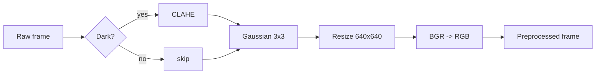

# data_pipeline.md

Full data lifecycle, from raw videos to training-ready `(30, 69)` sequence tensors.

## 1. Dataset Description

| Attribute | Value |
|---|---|
| Source | **Real Life Violence Situations Dataset** (Kaggle) |
| Total videos | **2000** |
| Classes | **Violence**, **NonViolence** |
| Label granularity | **Video-level** (note: contributes to label noise) |

## 2. Split Strategy

- **Stratified 70 / 15 / 15** train / val / test, preserving class proportions.
- Splits are computed **once**, persisted on disk, and reused by all training and evaluation runs.
- Random seed: **TBD** (must be recorded once chosen).
- The **test split is strictly isolated**: never used for training, validation, threshold tuning, or any model selection.

## 3. Suggested File / Folder Structure

> The exact layout is **TBD**; the structure below is a recommendation consistent with the locked decisions.

```text
data/
  raw/
    Violence/        # source videos
    NonViolence/
  interim/
    features/
      <video_id>.npy            # (N, 69) per-video feature array
  processed/
    splits.json                 # {video_id: train|val|test}
    sequences/
      train/
        violence/<video_id>_<start>.npy   # (30, 69) window
        nonviolence/<video_id>_<start>.npy
      val/...
      test/...
```

## 4. FPS Standardization

- All videos are resampled to **10 FPS** during offline preprocessing.
- The 30-frame **sequence window** therefore spans **~3 seconds** of motion.
- Online inference does **not** resample; it consumes the live source at its native frame rate.

## 5. Frame Preprocessing Order

Applied identically offline and online, in this strict order:

1. **Conditional CLAHE** on dark frames (heuristic-based; threshold and channel choice **TBD**).
2. **Gaussian blur 3×3**.
3. **Resize to 640×640**.
4. **BGR → RGB** conversion.



## 6. Pose Extraction

- Model: **YOLOv8n-Pose**.
- Output: **COCO 17 keypoints** per detected person, each with `(x, y, confidence)`.
- Detection backend, IoU/conf thresholds for person detection (separate from keypoint confidence): **TBD**.

## 7. Keypoint Confidence Filtering

- Per-keypoint confidence threshold: **0.5**.
- Keypoints with `conf < 0.5` are marked unreliable.
- Replacement strategy (zero-fill vs. last-known vs. interpolation): **TBD**, but must be applied identically offline and online.

## 8. Multi-Person Strategy

- Pick the **top 2** detected people (selection criterion — e.g. highest detection confidence — **TBD**).
- **Sort by X axis** (left-to-right) for stable indexing.
- Compute an interaction feature: **normalized bbox center distance** between the two persons.
- If only 1 person is detected: person-2 features are filled with a placeholder (**TBD**).
- If 0 persons are detected: see `inference.md` and §13 below.

## 9. Feature Vector Creation (69-dim per frame)

> The exact field decomposition into the 69-dim vector is **Not specified in the source PDF** and is **TBD**. The locked facts are:
>
> - Dimensionality is **69** per frame.
> - It is derived from up to **2 people × 17 keypoints (COCO)**, plus the **normalized inter-person bbox center distance**.
> - It is built on top of **hip-centered + shoulder–hip-scaled** skeletons (see §10).

The same feature builder must be reused verbatim in online inference.

## 10. Skeletal Normalization

- **Hip centering**: translate keypoints so the mid-hip point becomes the origin.
- **Shoulder–hip scaling**: divide coordinates by the torso length (mid-shoulder to mid-hip distance) so the skeleton is scale-invariant.
- Applied **per person** before concatenation into the 69-dim vector.

## 11. NPY Serialization

- One `.npy` per usable video, shape `(N, 69)`, where `N` is the number of sampled frames at 10 FPS.
- Files are written under `data/interim/features/` (recommended).
- Videos that fail extraction (corrupt file, fewer than 30 sampled frames, etc.) are logged and skipped.

## 12. Sequence Generation

- **Sliding window of 30 frames** over each `(N, 69)` feature array.
- Stride: **TBD** (commonly 1; record once chosen).
- Each window has shape `(30, 69)` and inherits its video's class label.
- The Violence/NonViolence label is **video-level**, then **propagated** to each window (this is the source of label noise the motion filter addresses).

## 13. Motion-Based Filtering

- Applied **only to Violence windows**.
- Threshold: **θ = 0.05**.
- Goal: drop low-motion Violence windows that are likely mislabeled due to video-level annotation. (A "Violence" video can contain calm pre/post moments that are mislabeled at the window level.)
- The exact motion statistic (e.g. mean absolute keypoint displacement, mean L2 displacement) is **TBD**; it must be computed on the normalized keypoints.
- **NonViolence windows are not filtered.**

## 14. Class Balancing Logic

- The motion filter implicitly affects class balance by removing some Violence windows.
- Additional balancing strategies (e.g. random undersampling of NonViolence, class weights in `BCELoss`, oversampling): **TBD**.

## 15. Edge Cases

| Case | Handling |
|---|---|
| Short videos (`< 30` sampled frames at 10 FPS) | Excluded from sequence assembly; logged |
| Corrupt / unreadable videos | Skipped; logged |
| Frames with **0 persons** detected | Feature vector handling **TBD**; must not crash; same rule offline + online |
| Frames with **1 person** detected | Person-2 placeholder **TBD**; interaction distance handling **TBD** |
| Persons fully overlapping | X-sort becomes unstable; accepted limitation (see `limitations.md`) |
| Keypoints with `conf < 0.5` | Marked unreliable; replacement strategy **TBD** |

## 16. Assumptions / Open Questions

- Exact composition of the 69-dim vector: **TBD.**
- Stride of the sliding window: **TBD.**
- Motion statistic used by the motion filter: **TBD.**
- Replacement rule for sub-threshold keypoints and missing persons: **TBD.**
- Random seed for the stratified split: **TBD.**
- Class-balancing strategy beyond the motion filter: **TBD.**
