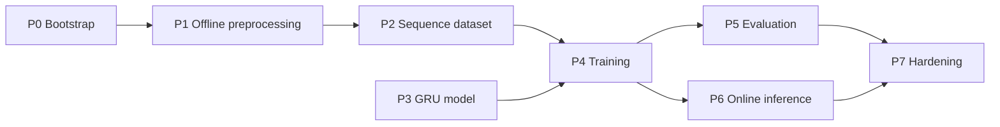

# project-plan.md

Execution roadmap turning the source PDF into an implementable plan. Phases are strictly ordered; later phases must not start before their dependencies are green.

## 1. Phases Overview

| #   | Phase                     | Output Artifact                                         |
| --- | ------------------------- | ------------------------------------------------------- |
| P0  | Project bootstrap         | repo skeleton, env, dataset access                      |
| P1  | Offline preprocessing     | per-video `.npy` feature arrays                         |
| P2  | Sequence dataset assembly | 30-frame sliding windows + motion-filtered Violence set |
| P3  | Model implementation      | `GRU` classifier module                                 |
| P4  | Training                  | best checkpoint by lowest val_loss                      |
| P5  | Evaluation                | metrics + ablation reports                              |
| P6  | Online inference          | live FIFO-buffer pipeline + on-screen overlay           |
| P7  | Hardening                 | limitation handling, threshold tuning, docs sync        |
| P8  | Dataset Blending          | RLVS + RWF-2000 preprocessing + blended model           |

## 2. Milestones

- **M1** — One sample video flows end-to-end through P1, producing a valid `(N, 69)` feature array. _(Depends on P0)_
- **M2** — Full dataset preprocessed; stratified **70 / 15 / 15** split persisted on disk. _(Depends on M1)_
- **M3** — Sequence dataset (30-frame windows) built; motion filter (θ = 0.05) applied to Violence. _(Depends on M2)_
- **M4** — GRU module forward + backward pass verified on a tiny batch. _(Depends on P3)_
- **M5** — Training run completes within max 100 epochs with early stopping; best checkpoint saved. _(Depends on M3 + M4)_
- **M6** — Evaluation produces confusion matrix, precision, recall, F1, AUC-ROC on the **test split**. _(Depends on M5)_
- **M7** — Online inference loop classifies a live source with **FIFO 30** + initial **threshold 0.7**. _(Depends on M5)_
- **M8** — Ablations completed: threshold study (done), interaction-feature study (done), normalization study (Kaggle-pending), motion-filter θ study (Kaggle-pending). _(Depends on M6)_
- **M9** — Blended dataset (RLVS+RWF-2000) processed, model retrained, evaluated. _(Done: train 6423 seq, test F1=0.820, AUC=0.927)_

## 3. Suggested Order of Implementation

1. P0: repo skeleton, dataset placement, basic OpenCV + Ultralytics smoke test.
2. P1.1: 10 FPS sampler.
3. P1.2: frame preprocessor (conditional CLAHE → Gaussian 3×3 → 640×640 → BGR→RGB).
4. P1.3: YOLOv8n-Pose extractor with **0.5** keypoint confidence filter.
5. P1.4: multi-person selector (top 2, X-sorted) + normalized bbox center distance.
6. P1.5: 69-dim feature vector builder + hip centering + shoulder–hip scaling.
7. P1.6: per-video `.npy` writer.
8. P2.1: stratified 70 / 15 / 15 split assignment.
9. P2.2: 30-frame sliding window builder.
10. P2.3: motion filter (θ = 0.05) on Violence windows.
11. P3: GRU module, sigmoid head.
12. P4: training loop (BCELoss, Adam, batch 32, max 100 epochs, early stopping on val_loss, best-by-lowest-val_loss).
13. P5: evaluation script (confusion matrix, precision, recall, F1, AUC-ROC).
14. P6: online inference loop with FIFO 30 buffer and threshold 0.7.
15. P7: ablations + threshold tuning + limitations handling.

## 4. Suggested Order of Validation

1. Unit-validate the 10 FPS sampler on a known clip.
2. Visually inspect 5 random preprocessed frames (CLAHE on/off cases).
3. Overlay YOLOv8n-Pose keypoints on those frames; confirm 17 keypoints.
4. Confirm feature vector shape `= 69` per frame across multiple videos.
5. Confirm sequence shape `= (30, 69)` per window.
6. Smoke-train on a subset (e.g. 50 videos) for 2 epochs; confirm loss decreases.
7. Run full training; confirm early stopping triggers correctly.
8. Run evaluation on **isolated** test split (never seen during training/val).
9. Validate online inference latency informally on a sample webcam feed.
10. Run all four ablations (see `evaluation.md`).

## 5. Dependencies Between Tasks

## 6. Checklist (status: done / in-progress / pending)

- [x] **P0.1** Repo skeleton — _done_
- [ ] **P0.2** Dataset acquisition (Real Life Violence Situations Dataset, 2000 videos) — _pending (Kaggle Notebook üzerinden)_
- [x] **P1.1** 10 FPS sampler — _done (Kaggle notebook)_
- [x] **P1.2** Frame preprocessor (conditional CLAHE → Gaussian 3×3 → 640×640 → BGR→RGB) — _done (Kaggle notebook)_
- [x] **P1.3** YOLOv8n-Pose extractor + keypoint confidence filter (0.5) — _done (Kaggle notebook)_
- [x] **P1.4** Multi-person selector (top 2, X-sorted) + normalized bbox center distance — _done (Kaggle notebook)_
- [x] **P1.5** 69-dim feature vector + hip centering + shoulder–hip scaling — _done (Kaggle notebook)_
- [x] **P1.6** Per-video `.npy` writer — _done (Kaggle notebook)_
- [x] **P2.1** Stratified 70 / 15 / 15 split — _done (Kaggle notebook)_
- [x] **P2.2** 30-frame sliding window builder — _done (Kaggle notebook)_
- [x] **P2.3** Motion filter on Violence windows (θ = 0.05) — _done (Kaggle notebook)_
- [x] **P3** GRU classifier (sigmoid output) — _done (src/model.py, 115,777 params)_
- [x] **P4** Training loop (BCELoss, Adam, batch 32, max 100 epochs, early stopping on val*loss, best by lowest val_loss) — \_done (src/train.py)*
- [x] **P5** Evaluation (confusion matrix, precision, recall, F1, AUC-ROC) — _done (src/evaluate.py)_
- [x] **P6** Online inference (FIFO 30 frames, threshold 0.7) — _done (src/inference.py)_
- [x] **P7.1** Threshold ablation (RLVS-only) — _done (best F1=0.827 at t=0.4)_
- [x] **P7.1b** Threshold ablation (blended model) — _done (best F1=0.820 at t=0.45, deployed)_
- [x] **P7.2** Interaction-feature ablation — _done (no-interaction: F1=0.825, AUC=0.931; ΔF1=+0.005 — feature not critical)_
- [ ] **P7.3** Normalization ablation — _pending (Kaggle preprocessing required — raw videos not local)_
- [ ] **P7.4** Motion-filter θ ablation — _pending (Kaggle preprocessing required)_
- [x] **P8.1** RWF-2000 Kaggle preprocessing notebook update — _done (notebooks/kaggle_preprocessing.ipynb v2)_
- [x] **P8.2** Blended sequences downloaded + local training — _done (train 6423 seq, GPU RTX 4060)_
- [x] **P8.3** Blended model evaluation — _done (test F1=0.820, AUC=0.927 at t=0.45)_
- [x] **P8.4** Full documentation sync — _done (2026-05-19)_

## 7. "Do Not Start Before" Notes

| Phase | Do not start before                                                                 |
| ----- | ----------------------------------------------------------------------------------- |
| P1    | P0 complete (env + dataset accessible)                                              |
| P2    | P1 has produced `.npy` for **all** videos in the dataset                            |
| P3    | P2 schema is fixed (`(30, 69)` sequence shape)                                      |
| P4    | P2 + P3 both done; split is persisted; motion filter applied on Violence only       |
| P5    | P4 has produced a checkpoint selected by **lowest val_loss**                        |
| P6    | P4 checkpoint exists and per-frame feature builder from P1 is reusable in real time |
| P7    | P5 baseline metrics exist (otherwise ablations have no reference)                   |

## 8. Assumptions / Open Questions

- Compute budget per training run: **Not specified in the source PDF.**
- Whether to persist intermediate (pre-window) `.npy` and (post-window) `.npy` separately: **TBD.**
- Whether to run preprocessing in parallel (multi-process): **TBD.**
- Whether ablations are mandatory before P7 close-out or optional: **TBD** (treated as required here).
