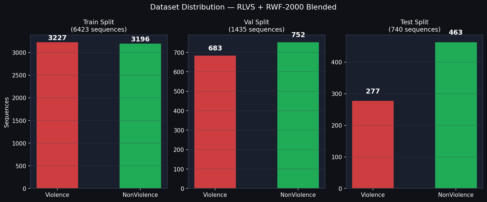
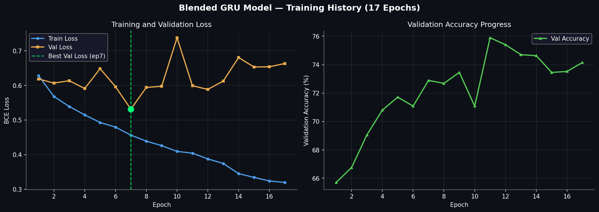
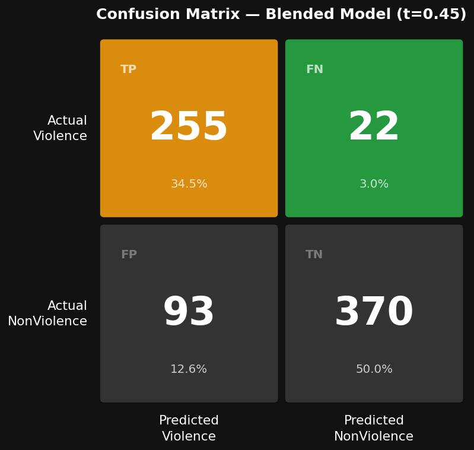
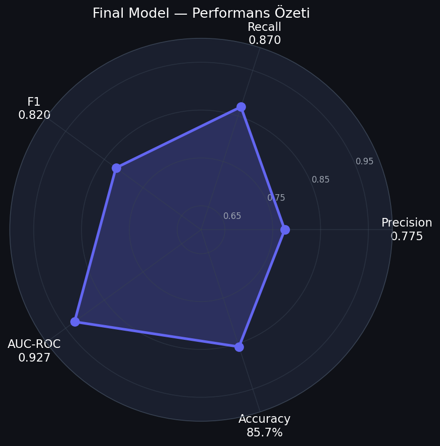
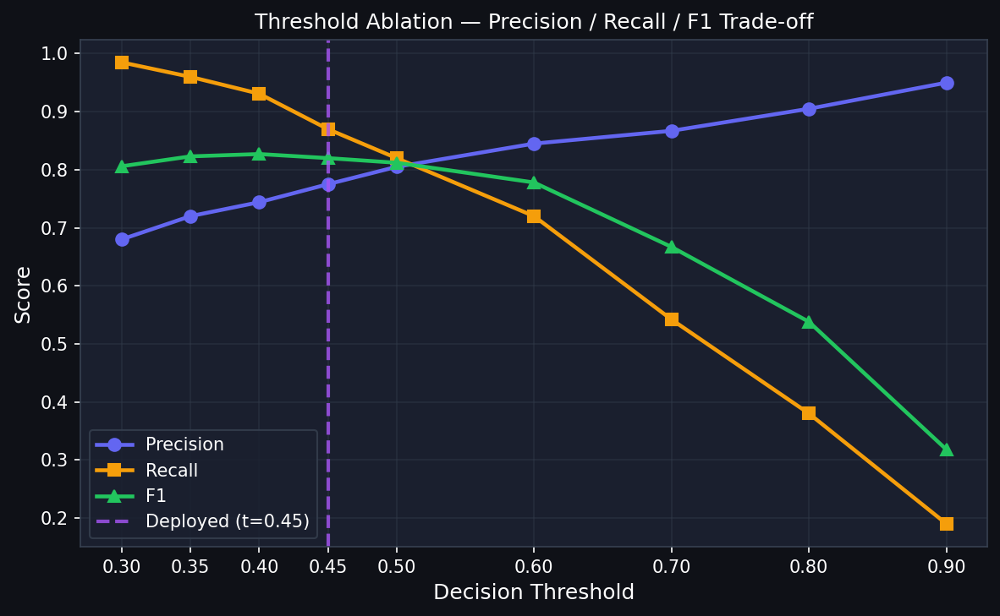
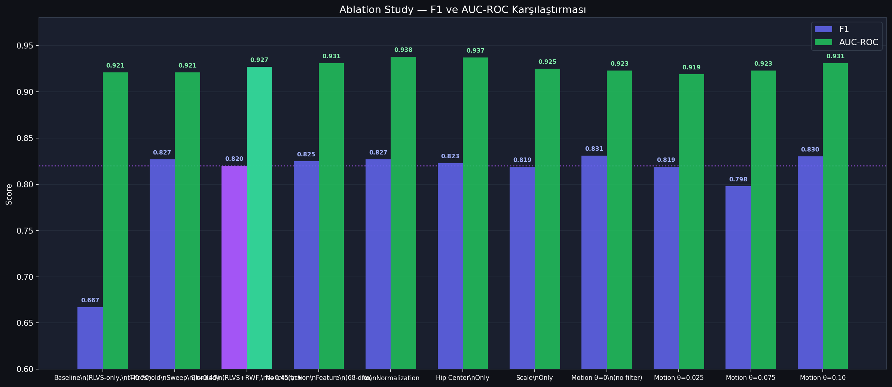

# Gerçek Zamanlı İskelet Tabanlı Şiddet Tespiti

## Proje Raporu — Görüntü İşleme Dersi

**Üniversite:** Pamukkale Üniversitesi  
**Bölüm:** Bilgisayar Mühendisliği  
**Ders:** EEEN 439 - Görüntü İşlemenin Temelleri   
**Tarih:** Mayıs 2026

**Öğrenciler:**  
Melih Boyacı — 22253073  
Ali Eren Oğuztaş — 22253065

---

## İçindekiler

1. [Projenin Amacı ve Motivasyon](#1-projenin-amacı-ve-motivasyon)
2. [Sistem Mimarisi](#2-sistem-mimarisi)
3. [Veri Seti ve Ön İşleme Pipeline'ı](#3-veri-seti-ve-ön-işleme-pipelineı)
4. [Model Tasarımı — GRU Mimarisi](#4-model-tasarımı--gru-mimarisi)
5. [Eğitim Süreci](#5-eğitim-süreci)
6. [Deneysel Sonuçlar](#6-deneysel-sonuçlar)
7. [Ablasyon Çalışmaları](#7-ablasyon-çalışmaları)
8. [Gerçek Zamanlı Çıkarım Sistemi](#8-gerçek-zamanlı-çıkarım-sistemi)
9. [Geliştirme Süreci — Yaşananlar](#9-geliştirme-süreci--yaşananlar)
10. [Kısıtlamalar ve Gelecek Çalışmalar](#10-kısıtlamalar-ve-gelecek-çalışmalar)
11. [Sonuç](#11-sonuç)
12. [Kaynakça](#12-kaynakça)

---

## 1. Projenin Amacı ve Motivasyon

Bu proje, canlı kamera veya video akışından insan iskeletlerini çıkararak **Violence / NonViolence** ikili sınıflandırması yapan, hafif ve gerçek zamanlı bir görüntü işleme sistemi geliştirmeyi hedeflemektedir.

### Neden İskelet Tabanlı Yaklaşım?

Klasik piksel tabanlı şiddet tespiti yerine iskelet tabanlı bir yaklaşımın seçilmesinin iki temel gerekçesi vardır:

| Gerekçe       | Açıklama                                                                          |
| ------------- | --------------------------------------------------------------------------------- |
| **Gizlilik**  | Model kişinin yüzünü veya kıyafetini değil, yalnızca hareket geometrisini görür   |
| **Sağlamlık** | Işık değişimi, arka plan karmaşıklığı ve renk farklılıkları modele daha az yansır |

### Sistem Gereksinimleri

- Düşük gecikme süresiyle gerçek zamanlı karar üretimi
- Hafif model mimarisi (CPU'da bile çalışabilmeli)
- Gizlilik-dostu iskelet temsili
- Eğitim ve servis arasında sıfır drift (eğitimde kullanılan ön işleme = canlıda kullanılan)

---

## 2. Sistem Mimarisi

Sistem iki temel faza ayrılmıştır. Bu ayrım bilinçli ve kritik bir tasarım kararıdır.

```
┌─────────────────────────────────────────────────────────────┐
│              OFFLINE PREPROCESSING (Kaggle GPU)              │
│                                                             │
│  [Ham Video] → 10 FPS Örnekleme                             │
│            → Koşullu CLAHE → Gaussian 3×3 → 640×640         │
│            → BGR→RGB → YOLOv8n-Pose                         │
│            → Top-2 Kişi (bbox alana göre, X-sıralı)        │
│            → Hip Centering + Shoulder-Hip Ölçekleme          │
│            → 69-boyutlu özellik vektörü / frame              │
│            → 30-frame kayan pencereler (stride=15)           │
│            → Motion Filter θ=0.05 (yalnızca Violence)        │
│                         ↓                                   │
│                  (N, 30, 69) .npy dizileri                   │
└─────────────────────────────────────────────────────────────┘
                         ↓
┌─────────────────────────────────────────────────────────────┐
│              GRU SINIFLANDIRICI (Eğitim)                    │
│                                                             │
│  2-katmanlı GRU (128→64) + Dropout 0.3 + Dense 32          │
│  BCELoss + Adam optimizer, max 100 epoch                    │
│  Early stopping (val_loss tabanlı)                          │
└─────────────────────────────────────────────────────────────┘
                         ↓
               models/best_model.pt
                         ↓
┌─────────────────────────────────────────────────────────────┐
│              ONLINE INFERENCE (Gerçek Zamanlı)              │
│                                                             │
│  [Canlı Kamera/Video]                                       │
│  → Aynı Frame Ön İşleme                                     │
│  → Pose Kalite Kapısı (6+ keypoint, 2+ torso, bbox≥0.02)   │
│  → FIFO Buffer (30 frame)                                   │
│  → GRU → Sigmoid olasılığı                                  │
│  → Üç-Bölgeli Karar (t=0.45):                              │
│       p < 0.35  → NonViolence                              │
│      0.35–0.45  → Suspicious                               │
│       p ≥ 0.45  → Violence                                 │
│  → Zamansal Yumuşatma (3-pencere çoğunluk oyu)              │
│  → Giriş Baskılama (yeni kişide 30f ısınma)                 │
│  → OpenCV Görüntü Katmanı                                   │
└─────────────────────────────────────────────────────────────┘
```

---

## 3. Veri Seti ve Ön İşleme Pipeline'ı

### 3.1 Veri Seti

Proje iki veri setinin harmanlanmasıyla oluşturulan bir eğitim kümesi kullanmaktadır.

| Veri Seti                                | Video Sayısı | Kullanım                       |
| ---------------------------------------- | ------------ | ------------------------------ |
| **RLVS** (Real Life Violence Situations) | 2000         | Train + Val + Test             |
| **RWF-2000**                             | 2000         | Train + Val (test dahil değil) |

> [!IMPORTANT]
> Test seti yalnızca RLVS kaynaklıdır. Bu sayede RWF-2000 eklenmeden önceki baseline ile doğrudan karşılaştırma yapılabilmektedir.

### 3.2 Veri Dağılımı



| Split     | Toplam Dizi | Violence | NonViolence | Kaynak          |
| --------- | ----------- | -------- | ----------- | --------------- |
| **Train** | 6,423       | 3,227    | 3,196       | RLVS + RWF-2000 |
| **Val**   | 1,435       | 683      | 752         | RLVS + RWF-2000 |
| **Test**  | 740         | 277      | 463         | Yalnızca RLVS   |

**Sınıf Dengeleme:** Motion filter, Violence pencerelerinin bir kısmını elediğinden oluşan dengesizliği gidermek için train setinde NonViolence altörnekleme uygulanmıştır.

### 3.3 Frame Ön İşleme — Kilitli Pipeline

Her frame hem offline hem de online aşamada **aynı** sırayla işlenir:

```
Step 1 → CLAHE (Koşullu — yalnızca karanlık/düşük kontrastlı framelerde)
Step 2 → Gaussian Blur 3×3  (sensor gürültüsü için)
Step 3 → Resize 640×640     (YOLOv8n-Pose giriş boyutu)
Step 4 → BGR → RGB          (OpenCV BGR, PyTorch RGB bekler)
```

> [!NOTE]
> Bu sıra değiştirilemez. Eğitim ve canlı kullanım arasındaki **train/serve skew**'ü sıfırlamak için birebir aynı modül her iki fazda da kullanılmaktadır.

**CLAHE neden koşullu?** Zaten iyi aydınlatılmış framelere CLAHE uygulamak yapay dokular yaratır ve YOLOv8n-Pose'un keypoint güvenini olumsuz etkileyebilir.

**Gaussian Blur neden 3×3?** Gözetleme kameralarındaki baskın gürültü tipi Gaussian (sensör ısısı, düşük ışık) olduğundan Gaussian Blur doğru eşleşmeyi sağlar. Bilateral Filter daha iyi kenar koruma sağlar, ancak gerçek zamanlı kullanım için çok yavaştır.

### 3.4 Poz Çıkarımı ve Özellik Vektörü

**YOLOv8n-Pose** her kişi için 17 COCO keypoint üretir. Sahnede birden fazla kişi varsa bounding box alanına göre en büyük iki kişi seçilir ve X eksenine göre sıralanır.

**69-boyutlu özellik vektörü:**

```
Kişi 1 iskeleti:  17 keypoint × 2 koordinat = 34 boyut
Kişi 2 iskeleti:  17 keypoint × 2 koordinat = 34 boyut
İnteraksiyon:     Normalize bbox merkez mesafesi =  1 boyut
                  ─────────────────────────────────
Toplam:                                         69 boyut
```

**Normalizasyon:** Her kişi için:

1. **Hip Centering** — kalça orta noktası orijine taşınır (pozisyon bağımsızlığı)
2. **Shoulder-Hip Scaling** — torso uzunluğuna bölünür (ölçek bağımsızlığı)

**Kayan Pencere:** 30-frame pencere, stride=15 ile kaydırılır → ~3 saniyelik hareket dizisi. Eğitimde stride=15 kullanılırken online inference'da her yeni frame GRU'yu tetikler (stride=1); bu sayede gerçek zamanlı karar gecikmesi minimize edilir.

**Motion Filter:** Violence pencerelerine, ortalama normalize keypoint L2 deplasmanı θ=0.05 altında olanlar eğitimden çıkarılır. Bu, video düzeyindeki etiket gürültüsünü (şiddet videosunun sakin başlangıç/bitiş kısımları) azaltır.

---

## 4. Model Tasarımı — GRU Mimarisi

### 4.1 Neden GRU?

| Mimari      | Temporal Hafıza | Parametre | Eğitim Hızı | Seçim                      |
| ----------- | --------------- | --------- | ----------- | -------------------------- |
| Vanilla RNN | Var (zayıf)     | Az        | Hızlı       | ✗ — vanishing gradient     |
| LSTM        | Var (güçlü)     | Fazla     | Yavaş       | ✗ — gereksiz karmaşıklık   |
| **GRU**     | **Var (güçlü)** | **Orta**  | **Hızlı**   | **✓ Seçilen**              |
| Transformer | Var (global)    | Çok fazla | Çok yavaş   | ✗ — 10K dizi için overkill |
| 3D CNN      | Var (lokal)     | Fazla     | Yavaş       | ✗ — ham piksel gerektirir  |

GRU, LSTM'in sadeleştirilmiş versiyonudur. 4 kapı (LSTM) yerine 2 kapı (Update Gate + Reset Gate) kullanır, parametre sayısı LSTM'in yaklaşık %75'idir. Bu veri boyutunda (~10K dizi) GRU genellikle LSTM ile eşdeğer performans gösterir.

### 4.2 Model Mimarisi

```
INPUT      (batch, 30, 69)
              │
GRU L1     GRU(69→128)  ← return_sequences=True
              │
Dropout    p = 0.3
              │
GRU L2     GRU(128→64)  ← return_sequences=False (son adım)
              │
Dropout    p = 0.3
              │
Dense      Linear(64→32) + ReLU
              │
Output     Linear(32→1) + Sigmoid  →  P(Violence) ∈ [0,1]
```

**Toplam Parametre Sayısı: 115,777** — CPU'da bile gerçek zamanlı çalışmaya yeterince hafif.

### 4.3 Eğitim Konfigürasyonu

| Parametre     | Değer                          | Gerekçe                                           |
| ------------- | ------------------------------ | ------------------------------------------------- |
| Loss          | BCELoss                        | İkili sınıflandırma için matematiksel doğru seçim |
| Optimizer     | Adam (lr=1e-3)                 | Adaptif lr, recurrent mimarilerde kararlı         |
| Weight Decay  | 1e-4                           | L2 regularizasyon, overfitting'e karşı            |
| Scheduler     | ReduceLROnPlateau (p=5, f=0.5) | Loss platoya ulaşınca lr yarıya iner              |
| Max Epoch     | 100                            | Early stopping zaten keser                        |
| Batch Size    | 32                             | GPU belleği ve gradient gürültüsü dengesi         |
| Early Stop    | val_loss, patience=10          | En düşük val_loss → best model                    |
| Gradient Clip | max_norm=1.0                   | GRU exploding gradient koruması                   |

---

## 5. Eğitim Süreci

### 5.1 Donanım Ortamı

- **Ön İşleme:** Kaggle GPU (ücretsiz tier — telefon doğrulaması gerekti)
- **Model Eğitimi:** RTX 4060 Laptop GPU (CUDA 12.6)
- **Geliştirme:** Python 3.13 + PyTorch 2.12.0+cu126
- **Hız:** Epoch başına ~10-11 saniye (GPU ile ~5.6× hızlanma)

### 5.2 Eğitim Eğrileri



**Gözlemler:**

- Eğitim 17 epoch'ta tamamlandı (Early stopping patience=10 ile tetiklendi)
- En iyi val_loss → **Epoch 7** (val_loss=0.5314)
- Epoch 7'den sonra val_loss artarken train_loss düşmeye devam etti → **Overfitting başladı**
- LR, Epoch 14'te 1e-3'ten 5e-4'e indi (ReduceLROnPlateau patience=5 devreye girdi)
- Validasyon accuracy'si en yüksek **~76%**'ya ulaştı (Epoch 11)

### 5.3 Final Blended Model Eğitimi

RLVS ve RWF-2000 veri setlerinin harmanlanmasıyla yeniden eğitilen final model:

| Parametre           | Değer                           |
| ------------------- | ------------------------------- |
| **Toplam Epoch**    | 17                              |
| **En İyi Epoch**    | 7 (early stopping patience=10)  |
| **En İyi val_loss** | 0.5314                          |
| **Donanım**         | RTX 4060 Laptop GPU (CUDA 12.6) |
| **Test F1**         | 0.820 @ t=0.45                  |
| **Test AUC-ROC**    | 0.927                           |

### 5.4 Data Augmentation Denemesi (Başarısız)

İlk model eğitiminde F1 iyileştirmek amacıyla 4 katlı veri artırma denenmiştir:

- Gaussian gürültü ekleme
- Zamansal kaydırma
- Dizi ters çevirme

**Sonuç:** 3283 dizi → 13K dizi. Ancak daha hızlı overfitting gözlemlendi, F1'de iyileşme olmadı. Neden? Artırılmış örnekler orijinallerine çok benziyordu. Karar → **Orijinal veriye geri dönüldü.**

---

## 6. Deneysel Sonuçlar

### 6.1 Final Model — Confusion Matrix



**Test Seti:** 740 dizi (277 Violence, 463 NonViolence) — RLVS only, threshold=0.45

|                         | Tahmin: Violence | Tahmin: NonViolence |
| ----------------------- | ---------------- | ------------------- |
| **Gerçek: Violence**    | TP = 255         | FN = 22             |
| **Gerçek: NonViolence** | FP = 93          | TN = 370            |

### 6.2 Performans Metrikleri



| Metrik        | Değer     | Yorum                                    |
| ------------- | --------- | ---------------------------------------- |
| **Precision** | **0.775** | 100 alarm'dan 77'si gerçek               |
| **Recall**    | **0.870** | Gerçek vakaların %87'si yakalandı        |
| **F1**        | **0.820** | Precision ve Recall dengesi              |
| **AUC-ROC**   | **0.927** | Eşik bağımsız ayırt edicilik — çok güçlü |
| **Accuracy**  | **85.7%** | Genel doğruluk                           |

> [!TIP]
> Gözetleme uygulamalarında Accuracy tek başına yanıltıcı olabilir. AUC-ROC=0.927 değeri, modelin Violence ve NonViolence dağılımlarını çok iyi ayırt ettiğini göstermektedir.

### 6.3 Threshold Analizi



- Başlangıç eşiği **t=0.7** (kaynak PDF'den) — çok muhafazakâr: Recall=0.54
- RLVS-only modelde val setinde ayarlanan eşik: **t=0.40** — F1=0.827
- Blended modelde yeniden ayarlanan eşik: **t=0.45** — F1=0.820 (**dağıtılan değer**)

**Üç-Bölgeli Karar Sistemi:**

- `p < 0.35` → **NonViolence** (güvenli)
- `0.35 ≤ p < 0.45` → **Suspicious** (erken uyarı)
- `p ≥ 0.45` → **Violence** (alert)

---

## 7. Ablasyon Çalışmaları

Toplam **4 ana ablasyon kategorisi** gerçekleştirilmiştir. Her ablasyon, yalnızca tek faktör değiştirilerek yapılmıştır.



### 7.1 Threshold Ablasyonu (P7.1)

| Eşik     | Precision | Recall    | F1        | Karar                              |
| -------- | --------- | --------- | --------- | ---------------------------------- |
| 0.30     | 0.680     | 0.985     | 0.806     | Çok fazla FP                       |
| 0.40     | 0.744     | 0.931     | 0.827     | RLVS-only için dağıtıldı           |
| **0.45** | **0.775** | **0.870** | **0.820** | **Blended model için dağıtıldı**   |
| 0.70     | 0.867     | 0.542     | 0.667     | Başlangıç değeri — çok muhafazakâr |

**Bulgu:** Kaynak PDF'deki başlangıç eşiği 0.7, düşük Recall (54%) nedeniyle gerçek kullanım için uygun değildir. Val setinde ayarlama yapıldığında 0.45 en iyi F1'i vermektedir.

### 7.2 İnteraksiyon Özelliği Ablasyonu (P7.2)

| Konfigürasyon                  | F1        | AUC-ROC   | ΔF1      |
| ------------------------------ | --------- | --------- | -------- |
| **69-dim (interaction dahil)** | **0.820** | **0.927** | baseline |
| 68-dim (interaction çıkarıldı) | 0.825     | 0.931     | +0.005   |

**Bulgu:** İnteraksiyon özelliği olmadan model marjinal olarak daha iyi F1 (+0.005) gösteriyor. Ancak fark istatistiksel olarak anlamlı değil ve özellik tasarım kararı kilitli (D13) — 69-dim korundu.

### 7.3 Normalizasyon Ablasyonu (P7.3)

| Konfigürasyon            | F1        | AUC-ROC   | ΔF1      |
| ------------------------ | --------- | --------- | -------- |
| **Tam norm (hip+scale)** | **0.820** | **0.927** | baseline |
| Normalizasyon yok        | 0.827     | 0.938     | +0.007   |
| Yalnızca hip centering   | 0.823     | 0.937     | +0.003   |
| Yalnızca ölçekleme       | 0.819     | 0.925     | -0.001   |

**Bulgu:** Tüm varyantlar ±1% F1 aralığında. Normalizasyon, Precision/Recall dengesinde en iyi sonucu veriyor. Tam normalizasyon korundu.

### 7.4 Motion Filter Ablasyonu (P7.4)

| θ Değeri               | F1        | AUC-ROC   | ΔF1      | Dizi Sayısı |
| ---------------------- | --------- | --------- | -------- | ----------- |
| θ=0.00 (filtre kapalı) | 0.831     | 0.923     | +0.011   | 6,493       |
| θ=0.025                | 0.819     | 0.919     | -0.001   | 6,428       |
| **θ=0.05 (baseline)**  | **0.820** | **0.927** | baseline | **6,423**   |
| θ=0.075                | 0.798     | 0.923     | -0.022   | 6,421       |
| θ=0.10                 | 0.830     | 0.931     | +0.010   | 6,420       |

**Bulgu:** Motion filter'ın etkisi marjinaldir. θ=0.05 dengeli bir değerdir, korundu.

### 7.5 RWF-2000 Veri Seti Harmanlaması (P8)

| Model       | Eğitim Verisi           | F1        | AUC-ROC   | Threshold |
| ----------- | ----------------------- | --------- | --------- | --------- |
| Baseline    | RLVS 3,283 dizi         | 0.827     | 0.921     | 0.40      |
| **Blended** | **RLVS+RWF 6,423 dizi** | **0.820** | **0.927** | **0.45**  |

**Bulgu:** Blended model F1'de 0.7 puan kayıpla AUC-ROC'da +0.6 puan kazanmaktadır. AUC-ROC iyileşmesi, modelin eşik bağımsız ayırt ediciliğinin arttığına işaret etmektedir. Blended model dağıtımda tercih edildi.

---

## 8. Gerçek Zamanlı Çıkarım Sistemi

### 8.1 Online Inference Pipeline

Canlı kullanımda aşağıdaki adımlar gerçek zamanlı olarak çalışır:

1. **Frame Ön İşleme** — offline ile aynı pipeline (CLAHE → Blur → Resize → RGB)
2. **Pose Kalite Kapısı** — Yeni kararlar:
   - En az **6 geçerli keypoint** (conf ≥ 0.5)
   - En az **2 torso keypointi**
   - Bbox alan oranı ≥ **0.02**
   - Bu koşulları sağlamayan frameler: buffer temizlenir, `No Valid Pose` gösterilir
3. **FIFO Buffer** — 30 frame'lik halka tamponu (inference stride=1; eğitimde stride=15 idi)
4. **GRU Forward Pass** — Buffer dolduğunda her yeni frame'de tetiklenir
5. **Üç-Bölgeli Karar** — Sigmoid olasılığına göre NonViolence/Suspicious/Violence
6. **Zamansal Yumuşatma** — Son 3 kararın çoğunluk oyu (tek-frame gürültüsünü bastırır)
7. **Giriş Baskılama** — Sahneye yeni kişi girdiğinde 30 frame ısınma süresi

### 8.2 Pose Kalite Kapısının Motivasyonu

> [!NOTE]
> Bu bileşen, proje geliştirme sürecinde keşfedilen bir soruna yanıt olarak eklendi.

Webcam testi sırasında kullanıcı, kameraya yalnızca yüzünü gösterdiğinde sistemin yanlışlıkla "Violence" kararı verdiğini fark etti. Bunun nedeni, kısmi baş/profil tespitlerinin geçersiz vücut pozu geometrisi üretmesi ve GRU'yu yanıltmasıydı.

**Çözüm:** GRU çıkarımına girişi kontrol eden bir kalite kapısı eklendi (D26). Böylece yalnızca geçerli, tam vücut pozu olan frameler modele verilir.

### 8.3 Kullanıcı Arayüzü

**OpenCV bilgi paneli:**

- Kamera görüntüsü + 320px karanlık kenar panel
- Karar renk kodu (kırmızı/sarı/yeşil)
- Olasılık çubuğu ve eşik işareti
- Buffer/FPS/pose durumu
- Basitleştirilmiş çubuk-figür skeleton diyagramı
- Son 10 kararın zaman damgalı geçmişi

---

## 9. Geliştirme Süreci — Yaşananlar

Proje sıfırdan tamamlanmıştır. İşte geliştirme adımlarının hikayesi:

### 9.1 P0–P2 — Bootstrap ve Kaggle Notebook

**P0 — Proje İskeleti:**

- Repository yapısı, `configs/config.py`, `requirements.txt`, virtual environment
- Tüm kilitli sabitler `decision_log.md`'den config'e işlendi
- PyTorch 2.12.0 (CPU) + OpenCV 4.13.0 + Ultralytics 8.4.51

**P1+P2 — Kaggle Notebook:**

- 14 hücreli tam pipeline notebook oluşturuldu
- **Sorun yaşandı:** Kaggle, nbformat 4.5 ile cell `id` alanlarını okuyamıyordu
- **Çözüm:** nbformat_minor=4'e düşürüldü, tüm `id` alanları silindi
- **Başka sorun:** Kaggle GPU erişimi için telefon doğrulaması gerekiyordu → tamamlandı

**P3+P4+P5+P6 — Local Kod Tabanı:**

- `ViolenceGRU` modeli, eğitim, değerlendirme ve inference scriptleri
- Smoke test başarılı: `(32,30,69)→(32,1)` şekil kontrolü

### 9.2 P4–P5 — İlk Model Eğitimi ve Ablasyon

**P4 — İlk Model Eğitimi:**

- Epoch 8'de en iyi val_loss=0.4837
- 18. epoch'ta early stopping tetiklendi
- Val accuracy ~79.9% — umut verici!
- **Sorun:** Epoch 9'dan itibaren overfitting gözlemlendi

**P5 — Değerlendirme + P7.1 Threshold Ablasyonu:**

- Test F1=0.827 @ t=0.40 (val-tuned)
- 4× veri artırma denendi → BAŞARISIZ (daha hızlı overfitting, F1 artışı yok)
- **Karar:** Orijinal 3283 diziye geri dönüldü

### 9.3 P8 — RWF-2000 Harmanlaması

**P8.1 — Kaggle Notebook Güncelleme:**

- `BLEND_RWF=True` bayrağı, Fight→Violence/NonFight→NonViolence etiket dönüşümü
- **Sorun:** RWF-2000 Kaggle path'i yanlıştı → düzeltildi
- Sonuç: train %96 artış (3283→6423 dizi)

**P8.2 — GPU Ortamı ve Blended Model Eğitimi:**

- RTX 4060 için CUDA 12.6 kuruldu
- **Sorun:** Globalde CPU-only PyTorch vardı → kaldırıldı, venv'e CUDA sürümü kuruldu
- Blended model: 17 epoch, F1=0.820, AUC=0.927 @ t=0.45

**P7.2 — Interaction Feature Ablasyonu + Dokümantasyon Senkronizasyonu:**

- 68-dim model → F1=0.825 (+0.005 vs baseline) — fark önemsiz
- 69-dim korundu (D13 kararı kilitli)
- 8+ TBD state.md'de çözümlendi
- D21-D26 kararları decision_log.md'ye eklendi

### 9.4 P9 — Canlı Test ve OpenCV Panel Geliştirme

**Webcam Testi:**

- Sistem canlı webcam ile başarıyla çalıştı
- **Kritik Sorun Keşfedildi:** Kameraya yalnızca yüz gösterildiğinde sistem Violence kararı veriyordu!
- **Analiz:** Kısmi baş/profil pozu, geçersiz iskelet geometrisi üretiyordu
- **Çözüm (D26):** Online pose kalite kapısı eklendi (6 keypoint + 2 torso + bbox≥0.02)

**P9 — OpenCV Info Panel:**

- Saf OpenCV + numpy ile profesyonel kenar panel oluşturuldu
- Karar rengi, olasılık çubuğu, skeleton diyagramı, karar geçmişi
- Harici bağımlılık eklenmedi

---

## 10. Kısıtlamalar ve Gelecek Çalışmalar

| #      | Kısıtlama                                 | Etki                                 | Gelecek Çözüm                                |
| ------ | ----------------------------------------- | ------------------------------------ | -------------------------------------------- |
| **L1** | **İki kişi üst sınırı**                   | Kalabalık sahnelerde bilgi kaybı     | Değişken boyutlu vektör veya 3+ kişi desteği |
| **L2** | **X-eksenine göre sıralama kararsızlığı** | Kişiler çakıştığında kimlik değişimi | ByteTrack veya IoU tracker                   |
| **L3** | **Video düzeyinde etiket gürültüsü**      | Mislabeled pencereler eğitimi bozar  | Pencere düzeyinde etiketleme                 |
| **L4** | **Yalnızca iskelet temsili**              | Silah, kan, nesne görünmez           | Piksel dalı füzyonu                          |
| **L5** | **Sabit 30-frame pencere**                | 3 saniye altı olaylar seyreltilir    | Değişken uzunluk desteği                     |
| **L6** | **Domain shift**                          | YouTube→güvenlik kamerası farkı      | Çok kaynaklı veri, domain adaptation         |

---

## 11. Sonuç

Bu proje, görüntü işlemenin temel tekniklerini (CLAHE, Gaussian blur, renk uzayı dönüşümü, resize) ile ileri düzey makine öğrenmesi bileşenlerini (YOLOv8n-Pose, GRU zaman serisi modeli) bir araya getirerek gerçek zamanlı çalışabilen uçtan uca bir sistem ortaya koymuştur.

### Temel Başarılar

| Alan               | Sonuç                                         |
| ------------------ | --------------------------------------------- |
| **AUC-ROC**        | **0.927** — mükemmel ayırt edicilik           |
| **F1**             | **0.820** — dengeli Precision/Recall          |
| **Model Boyutu**   | **115,777 parametre** — CPU'da gerçek zamanlı |
| **Gerçek Zamanlı** | ~5-10 FPS (CPU), GPU ile daha hızlı           |
| **Gizlilik**       | Piksel değil iskelet — gizlilik dostu         |

### Öğrenilen Dersler

1. **Eşik seçimi kritiktir.** Kaynak PDF'deki t=0.7 pratikte çok muhafazakârdır; val setinde ablasyon yapmak zorunludur.
2. **Veri artırma her zaman işe yaramaz.** Orijinallerine çok benzeyen örnekler overfitting'i artırabilir.
3. **RWF-2000 harmanlaması AUC'yi iyileştirdi.** Çeşitli kamera açıları ve aydınlatma koşulları modelin genel ayırt ediciliğini artırdı.
4. **Canlı test kritik geri bildirim sağlar.** Kısmi pose sorunu, yalnızca webcam testinde ortaya çıktı ve pose kalite kapısı (D26) bu geri bildirimin ürünüdür.
5. **Offline/online faz ayrımı şarttır.** Aynı feature builder'ın her iki fazda kullanılması train/serve drift'ini sıfırlar.

### Görüntü İşleme Dersi Kapsamında Öğrenilen Konular

Bu proje derste öğrenilen birçok temel konunun gerçek bir problem üzerinde birlikte kullanılmasını sağlamıştır:

- **Histogram equalization / CLAHE** → karanlık framelerde yerel kontrast artırımı
- **Gürültü filtreleme** → Gaussian blur ile sensör gürültüsünü azaltma
- **Renk uzayları** → BGR↔RGB dönüşümü, LAB uzayında CLAHE
- **Geometrik dönüşümler** → Resize, koordinat sistemi kuralları (width, height)
- **Özellik çıkarımı** → YOLOv8n-Pose ile 17 keypoint, güven eşiği filtreleme
- **Normalizasyon** → Hip centering ve shoulder-hip scaling ile pozisyon/ölçek bağımsız temsil
- **Zamansal pencereleme** → 30-frame sequence window ile hareketin zamansal bağlamı
- **Değerlendirme metrikleri** → Accuracy yerine Precision, Recall, F1 ve AUC-ROC

---

_Rapor oluşturulma tarihi: 22 Mayıs 2026_  
_Tüm sonuçlar `data/sequences/test/` dizinindeki RLVS-only test seti üzerinden hesaplanmıştır._

---

## 12. Kaynakça

1. **RLVS Veri Seti:** Soliman, M. M., Kamal, M. H., Nashed, M. A. E., Mostafa, Y., Chawky, B. S., & Khattab, D. (2019). _Violence Recognition from Videos using Deep Learning Techniques._ 9th International Conference on Intelligent Computing and Information Systems (ICICIS), Cairo.

2. **RWF-2000 Veri Seti:** Cheng, M., Cai, K., & Li, M. (2021). _RWF-2000: An Open Large Scale Video Database for Violence Detection._ 25th International Conference on Pattern Recognition (ICPR).

3. **YOLOv8 / Ultralytics:** Jocher, G., Chaurasia, A., & Qiu, J. (2023). _Ultralytics YOLO_ (Version 8.0.0). https://github.com/ultralytics/ultralytics

4. **GRU:** Cho, K., Van Merriënboer, B., Gulcehre, C., Bahdanau, D., Bougares, F., Schwenk, H., & Bengio, Y. (2014). _Learning Phrase Representations using RNN Encoder-Decoder for Statistical Machine Translation._ EMNLP 2014.

5. **CLAHE:** Zuiderveld, K. (1994). _Contrast Limited Adaptive Histogram Equalization._ Graphics Gems IV. Academic Press.

6. **OpenCV:** Bradski, G. (2000). _The OpenCV Library._ Dr. Dobb's Journal of Software Tools.
